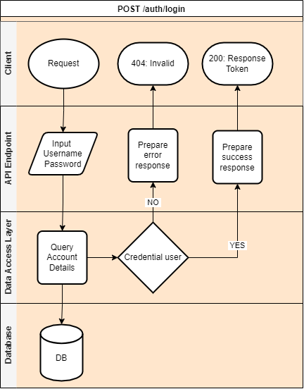

# api-sejutaCita

Berikut adalah API User Sejuta Cita menggunakan Express JS by Yohanes Krisna Yana Javista.

## Dokumentasi
Untuk Link Dokumentasi bisa klik [disini](http://34.101.65.182/api-docs/).

Base URL : http://34.101.65.182/

**CREDENTIAL Admin (Body API Login)**
```json
{
    "username": "admin001",
    "password": "admin001"
}
```

**CREDENTIAL USER 1 (Body API Login)**
```json
{
    "username": "yohaneskrisna",
    "password": "sejutaCitaKrisna"
}
```

**CREDENTIAL USER 2 (Body API Login)**
```json
{
    "username": "userKrisna",
    "password": "userKrisna001"
}
```

## Diagram
### Login : 
Gambar dibawah ini adalah diagram yang menjelaskan alur proses Login :



### Refresh Token : 
Gambar dibawah ini adalah diagram yang menjelaskan alur proses refresh Token :


### User Details (All Users) : 
Gambar dibawah ini adalah diagram yang menjelaskan alur proses mengambil data user dari database :


### Get Users (For Admin) : 
Gambar dibawah ini adalah diagram yang menjelaskan alur proses get all users :


### Create Users (For Admin) : 
Gambar dibawah ini adalah diagram yang menjelaskan alur proses add user :


### Get User By ID (For Admin) : 
Gambar dibawah ini adalah diagram yang menjelaskan alur proses get user by ID :


### Update Users By ID (For Admin) : 
Gambar dibawah ini adalah diagram yang menjelaskan alur proses update user :


### Delete Users By ID (For Admin) : 
Gambar dibawah ini adalah diagram yang menjelaskan alur proses delete user :


